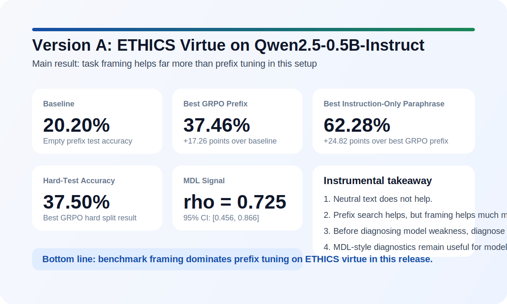

# Version A: ETHICS Virtue, Qwen2.5, and the Limits of Prefix Optimization




This repository is a clean public release of a single, highly diagnostic experiment: can training-free GRPO prefix search materially improve moral classification on the ETHICS `virtue` benchmark, or is the real bottleneck the way the task is framed?

The central result is clear: in this setup, **task framing is the dominant lever**. The best GRPO prefix improves test accuracy from **20.20%** to **37.46%**, but a budget-matched instruction-only paraphrase reaches **62.28%**. That means the biggest gain does not come from optimizing more prefix tokens. It comes from telling the model the job in a way that actually matches the benchmark.

## Why This Repository Is Useful

If you work on alignment, evaluation, prompt optimization, or benchmark methodology, this release is useful for a practical reason: it shows how easy it is to misread benchmark behavior if task framing is not controlled.

- Benchmark failure can be a presentation problem before it is a capability problem.
- Neutral text controls matter, because fluent text alone does not help here.
- Prefix optimization can help, but it should not automatically be interpreted as deeper moral competence.
- MDL-style diagnostics still add value, because lower development code length tracks better held-out performance in this release.

## Main Findings

### Test accuracy

| Condition | Test Accuracy | 95% CI |
| --- | ---: | ---: |
| Baseline (empty prefix) | 20.20% | 19.10% - 21.31% |
| Neutral prefix (best L) | 20.18% | 19.07% - 21.31% |
| Best GRPO prefix | 37.46% | 36.78% - 38.13% |
| Best instruction-only paraphrase | 62.28% | 61.56% - 63.01% |

### Hard-test and calibration

| Condition | Hard Accuracy | ECE |
| --- | ---: | ---: |
| Baseline | 20.23% | 0.4975 |
| Best GRPO prefix | 37.50% | 0.3741 |

### MDL diagnostic signal

- Spearman correlation between `Delta L_dev(L)` and test accuracy: **0.725**
- 95% CI: **[0.456, 0.866]**

### What the results mean

1. **Neutral text does nothing.** The neutral-prefix control stays at baseline, so gains are not explained by simply prepending coherent language.
2. **GRPO prefix search helps.** The best prefix materially improves both test accuracy and hard-test accuracy, and it also improves calibration.
3. **Instruction framing helps much more.** The best paraphrase beats the best learned prefix by **24.82 percentage points**, which is the main empirical lesson of the release.

## Deep Takeaway

The important point is not just that one method scored higher than another. It is that **apparent benchmark weakness can reflect a mismatch between the model and the task interface**.

That makes this repository more than a results dump. It is a compact case study in how to separate:

- genuine prefix effects,
- framing effects,
- and benchmark artifacts.

For a reader trying to build better evaluations, the instrumental lesson is simple: before concluding that a model lacks moral knowledge, first check whether the prompt is asking the model the right question in the right way.

## Quick Links

- Public repository: [version-a-ethics-qwen25-release-2026-04-08](https://github.com/hanzhenzhujene/version-a-ethics-qwen25-release-2026-04-08)
- Release page: [Version A Release](https://github.com/hanzhenzhujene/version-a-ethics-qwen25-release-2026-04-08/releases/tag/v1.0.0)
- Final paper PDF: [paper/version_a_latest.pdf](paper/version_a_latest.pdf)
- Timestamped paper PDF: [paper/version_a_paper_2026-04-08.pdf](paper/version_a_paper_2026-04-08.pdf)
- Main result tables: [results/version_a/tables/](results/version_a/tables/)
- MDL figure: [results/version_a/figures/mdl_curves.pdf](results/version_a/figures/mdl_curves.pdf)

## What Is Included

### Paper and release assets

- [paper/0331_version_a.tex](paper/0331_version_a.tex)
- [paper/version_a_latest.pdf](paper/version_a_latest.pdf)
- [paper/version_a_paper_2026-04-08.pdf](paper/version_a_paper_2026-04-08.pdf)

### Experiment specification and code

- [version_a_experiment_instructions.md](version_a_experiment_instructions.md)
- [version_a_strict_runner.py](version_a_strict_runner.py)
- [clean_suffix_candidate_pool_v2.json](clean_suffix_candidate_pool_v2.json)

### Data and outputs

- [ethics/](ethics/)
- [results/version_a/](results/version_a/)
- [results/version_a/reproducibility_note_2026-04-08.md](results/version_a/reproducibility_note_2026-04-08.md)
- [results/version_a/audit_2026-04-08.json](results/version_a/audit_2026-04-08.json)
- [results/version_a/deliverables_checklist.json](results/version_a/deliverables_checklist.json)

## Repository Layout

```text
assets/                    README visual summary
paper/                     Paper source and final PDFs
ethics/                    ETHICS benchmark files used locally
results/version_a/         Full experiment outputs
version_a_experiment_instructions.md
version_a_strict_runner.py
clean_suffix_candidate_pool_v2.json
```

## Reproducing the Experiment

The original run used a local Qwen model setup and the local ETHICS copy bundled here. The result package includes the exact split hashes used for the paper.

Run from the repository root:

```bash
python3 version_a_strict_runner.py \
  --results-root results/version_a \
  --source-virtue-dir ethics/virtue \
  --seeds 0,1,2 \
  --grpo-editor-mode free_prefix \
  --sampling-strategy stratified \
  --reward-metric accuracy
```

Python dependencies used by the runner are listed in [requirements.txt](requirements.txt).

## Validation and Reproducibility

This release includes:

- all **27 GRPO runs**
- all **9 instruction-paraphrase runs**
- split hashes for `Train_opt` and `Train_dev`
- per-run predictions
- paper-ready tables and figures
- a passing deliverables checklist

The release was also manually audited after packaging to confirm that the summary outputs and run directories remained complete.

## License

Original code and repository-authored documentation in this repository are released under the [MIT License](LICENSE).

Third-party materials are not relicensed by that file. In particular, the bundled ETHICS benchmark materials under [ethics/](ethics/) retain their own upstream license and attribution. See [THIRD_PARTY_NOTICES.md](THIRD_PARTY_NOTICES.md) and [ethics/LICENSE](ethics/LICENSE).

## Scope Note

This repository captures a **single-task, single-model** result: ETHICS `virtue` on `Qwen2.5-0.5B-Instruct`. The strongest conclusion is therefore diagnostic rather than universal. But that conclusion is already meaningful: in this setup, **benchmark framing matters more than prefix tuning**, and that should change how similar evaluations are designed and interpreted.
